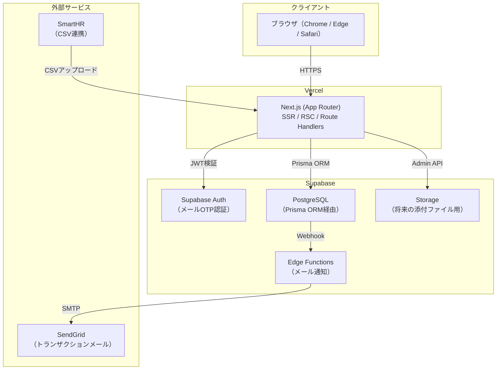
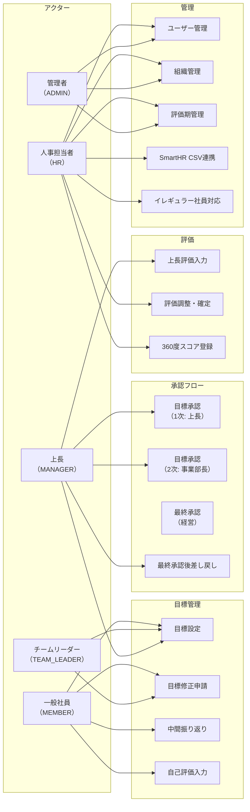
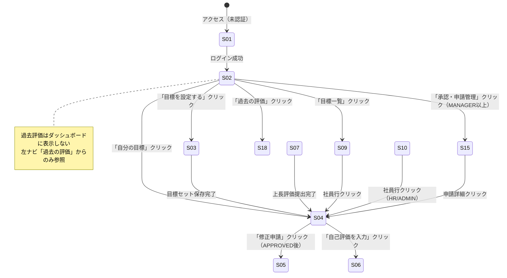
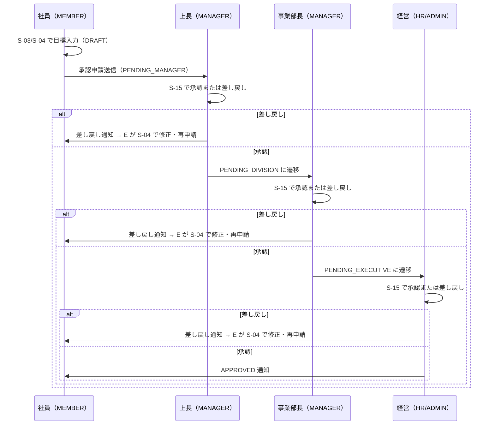
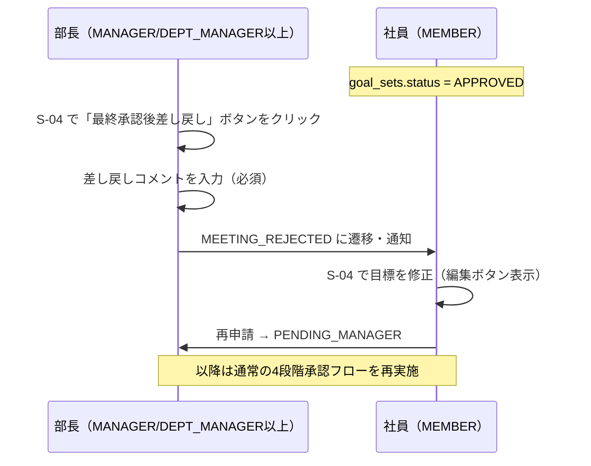
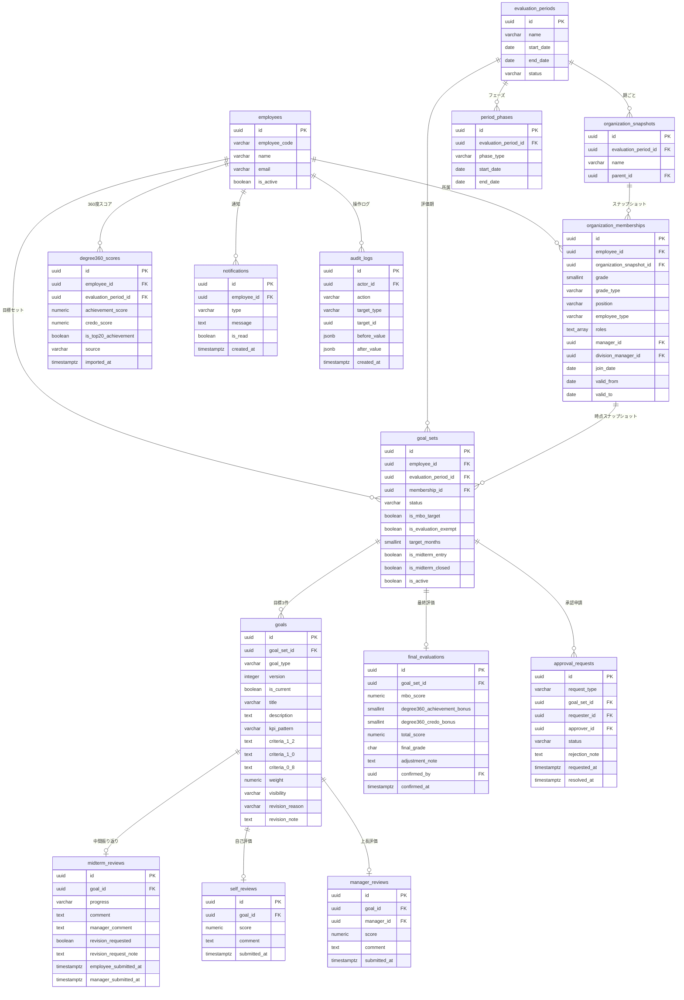
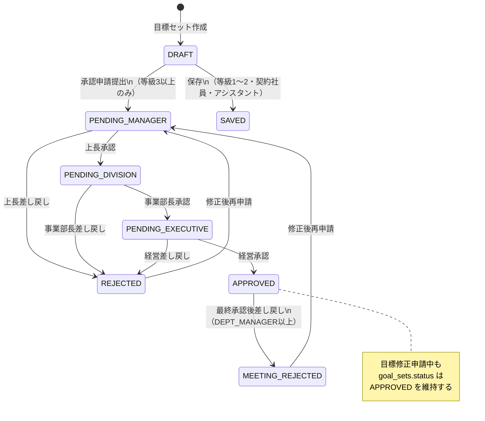
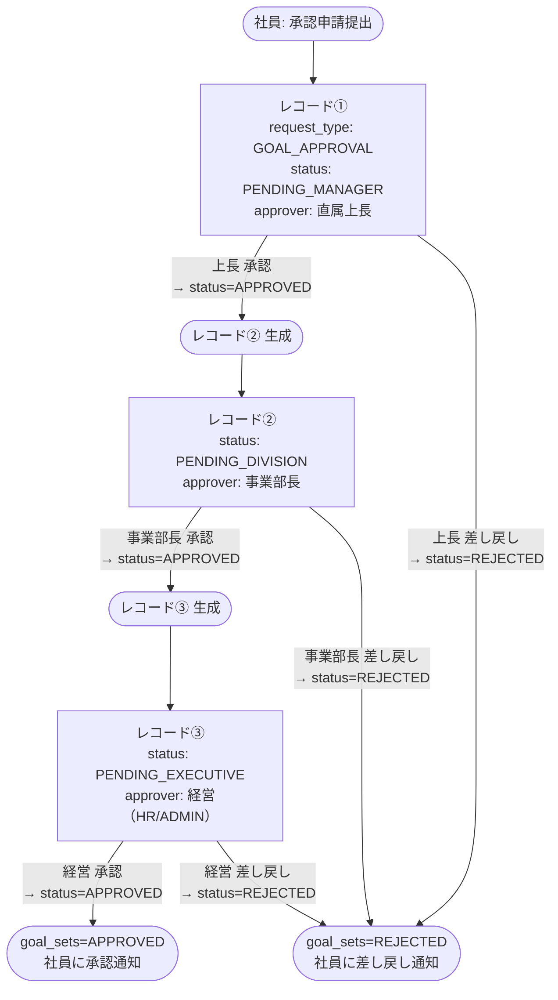

# 機能設計書

**プロジェクト名**: 社内MBO管理システム  
**バージョン**: 1.0  
**作成日**: 2026-04-30  
**対象読者**: 開発担当者、プロジェクトマネージャー  
**参照**: `docs/specification.md` v1.9 / `docs/product-requirements.md` v1.0

---

## 目次

1. [システム構成](#1-システム構成)
2. [ユースケース設計](#2-ユースケース設計)
3. [画面遷移図](#3-画面遷移図)
4. [ワイヤフレーム](#4-ワイヤフレーム)
5. [データモデル](#5-データモデル)
6. [コンポーネント設計](#6-コンポーネント設計)
7. [API設計](#7-api設計)
8. [通知設計](#8-通知設計)

---

## 1. システム構成

### 1.1 アーキテクチャ概要



### 1.2 技術スタック

| レイヤー | 技術 | 役割 |
| ------- | -- | -- |
| フロントエンド | Next.js 16 (App Router) + TypeScript | ページレンダリング・ルーティング |
| UIコンポーネント | shadcn/ui + Tailwind CSS | デザインシステム・アクセシビリティ |
| バックエンド | Next.js Route Handlers | REST API実装 |
| ORM | Prisma | 型安全なDB操作・マイグレーション |
| データベース | PostgreSQL (Supabase) + PgBouncer | メインDB・コネクションプール |
| 認証 | Supabase Auth | メールOTP認証（パスワード不要）・JWT発行・セッション管理 |
| ホスティング | Vercel | CI/CD・プレビュー環境 |
| メール通知 | Supabase Edge Functions + SendGrid | 承認通知・リマインダー |
| CI/CD | GitHub Actions + Vercel | Lint・テスト・デプロイ自動化 |

### 1.3 ディレクトリ構成

```
src/
├── app/
│   ├── (auth)/
│   │   └── login/                    # S-01 ログイン画面
│   └── (main)/
│       ├── dashboard/                # S-02 ダッシュボード
│       ├── goals/
│       │   ├── page.tsx              # S-09 目標一覧（自部署）
│       │   ├── all/                  # S-10 目標一覧（全社）
│       │   ├── new/                  # S-03 目標設定画面
│       │   └── [goalSetId]/
│       │       ├── page.tsx          # S-04 目標詳細・編集画面
│       │       ├── revision/         # S-05 目標修正申請画面
│       │       ├── self-review/      # S-06 自己評価入力画面
│       │       └── manager-review/   # S-07 上長評価入力画面
│       ├── approvals/                # S-15 承認・申請管理画面
│       ├── evaluations/
│       │   └── history/              # S-18 過去の評価閲覧画面
│       ├── employees/
│       │   └── [employeeId]/         # S-11 社員プロフィール・履歴画面
│       ├── reports/
│       │   └── summary/              # S-16 評価サマリ画面
│       ├── notifications/            # S-17 通知一覧画面
│       └── admin/
│           ├── users/                # S-12 ユーザー管理画面
│           ├── organizations/        # S-13 組織管理画面
│           ├── periods/              # S-14 評価期管理画面
│           └── review-adjustment/    # S-08 評価調整・確定画面
│   └── api/
│       ├── goals/
│       ├── approvals/
│       ├── reviews/
│       └── admin/
├── components/
│   ├── ui/                           # shadcn/ui ベースの基本コンポーネント
│   ├── goals/                        # 目標関連コンポーネント
│   ├── reviews/                      # 評価関連コンポーネント
│   ├── approvals/                    # 承認関連コンポーネント
│   └── layout/                       # ヘッダー・サイドバー等
├── lib/
│   ├── auth.ts                       # Supabase Auth設定
│   ├── db.ts                         # Prismaクライアント
│   └── permissions.ts                # 権限チェックロジック
├── prisma/
│   ├── schema.prisma
│   └── migrations/
└── types/
    └── index.ts                      # 共通型定義
```

---

## 2. ユースケース設計

### 2.1 ユースケース図



### 2.2 主要ユースケース一覧

| ID | ユースケース名 | 主アクター | 前提条件 | 後条件 |
| -- | --------- | ------- | ------ | ----- |
| UC-01 | 目標設定 | MEMBER以上 | 目標設定フェーズ中 / 未設定 | goal_sets レコード作成・DRAFT |
| UC-02 | 承認申請提出 | MEMBER以上（等級3以上） | DRAFT状態 | PENDING_MANAGER に遷移 |
| UC-03 | 上長承認 | MANAGER | PENDING_MANAGER | PENDING_DIVISION に遷移 |
| UC-04 | 事業部長承認 | MANAGER（DEPT_MANAGER以上） | PENDING_DIVISION | PENDING_EXECUTIVE に遷移 |
| UC-05 | 経営承認 | MANAGER（DEPT_MANAGER以上）/ HR / ADMIN | PENDING_EXECUTIVE | APPROVED に遷移 |
| UC-06 | 差し戻し | 各段階の承認者 | PENDING_* | REJECTED に遷移・社員に通知 |
| UC-07 | 目標修正申請 | MEMBER以上 | APPROVED状態 | 修正申請レコード作成 |
| UC-08 | 最終承認後差し戻し | MANAGER（DEPT_MANAGER以上）/ HR / ADMIN | APPROVED状態 | MEETING_REJECTED に遷移 |
| UC-09 | 中間振り返り入力 | MEMBER以上 | 中間振り返りフェーズ中 | midterm_reviews 更新 |
| UC-10 | 自己評価入力 | MEMBER以上（等級3以上） | 自己評価フェーズ中 | self_reviews 更新 |
| UC-11 | 上長評価入力 | MANAGER | 自己評価提出済み | manager_reviews 更新 |
| UC-12 | 評価調整・確定 | HR / ADMIN | 上長評価完了後 | final_evaluations 確定 |

---

## 3. 画面遷移図

### 3.1 全体の画面遷移



### 3.2 承認フロー画面遷移



### 3.3 最終承認後差し戻しフロー



---

## 4. ワイヤフレーム

### 4.1 S-02 ダッシュボード

```
┌──────────────────────────────────────────────────────┐
│  ┌──────────┐  MBO管理システム               🔔 山田太郎 ▼  │
│  │  ロゴ   │                                             │
│  └──────────┘                                             │
├──────────┬───────────────────────────────────────────────┤
│ナビゲーション│  現在のフェーズ: 目標設定フェーズ  2025/10/01〜2026/01/31  │
│          ├──────────────────────┬──────────────────────────┤
│ ダッシュボード│  自分の目標サマリ           │  対応事項                │
│ 自分の目標  │  ┌────────────────────┐  │  ┌────────────────────┐ │
│ 目標一覧    │  │ KPI連動① [下書き]     │  │  ・目標承認が待ちです │ │
│ 中間振り返り│  │ 売上1000万達成         │  │   （佐藤さん）        │ │
│ 過去の評価  │  ├────────────────────┤  │  ・中間振り返りを入力  │ │
│          │  │ KPI連動② [承認済み]   │  │   してください        │ │
│ 管理       │  │ 新規顧客30社獲得       │  └────────────────────┘ │
│ 承認・申請  │  ├────────────────────┤  │                          │
│ 評価調整    │  │ 組織貢献 [承認済み]    │  │                          │
│           │  │ 採用オンボーディング   │  │                          │
│（HR/ADMIN）│  └────────────────────┘  │                          │
│ イレギュラー│                          │                          │
│ SmartHR   │                          │                          │
└──────────┴──────────────────────┴──────────────────────────┘
```

### 4.2 S-04 目標詳細・編集画面

```
┌────────────────────────────────────────────────────────┐
│  2025年度 / 山田太郎 / 営業部 / 等級4                       │
│  ステータス: [承認済み ✓]                                   │
│  承認ステップ: 本人（済）→ 上長（済）→ 事業部長（済）→ 経営（済●）→ 確定  │
├─────────────────────────────────────────────────────────┤
│  タブ: [目標詳細] [バージョン履歴] [ステータス履歴]              │
├─────────────────────────────────────────────────────────┤
│  ┌───────────────────────────────────────────────────┐  │
│  │ KPI連動① [分解]                     重み: 50%      │  │
│  │ タイトル: 売上1000万達成                              │  │
│  │ 達成基準:  1.2 ... │ 1.0 ... │ 0.8 ...             │  │
│  │ 中間振り返り: 順調に進行中...                          │  │
│  │ 自己評価: 1.0 / コメント: ...                        │  │
│  │ 上長評価: 1.0 / コメント: ...                        │  │
│  └───────────────────────────────────────────────────┘  │
│  ┌───────────────────────────────────────────────────┐  │
│  │ KPI連動② ...（同様の構成）                           │  │
│  └───────────────────────────────────────────────────┘  │
│  ┌───────────────────────────────────────────────────┐  │
│  │ 組織貢献 ...（同様の構成）                             │  │
│  └───────────────────────────────────────────────────┘  │
│                                                          │
│  [最終承認後差し戻し]（APPROVED時・DEPT_MANAGER以上に表示）    │
└─────────────────────────────────────────────────────────┘
```

### 4.3 S-09 目標一覧画面（自部署）

```
┌────────────────────────────────────────────────────────────────┐
│  目標一覧（自部署）                                                │
│  評価期: [2025年度 ▼]   部署: [営業部 ▼]   ステータス: [全て ▼]    │
│  キーワード: [        ]  目標設定会議モード: [ OFF ]                │
├────────┬──────┬──────────────┬────────────────────┬──────┬──────┤
│ 社員名  │等級  │ 目標タイトル  │ 承認ステップ         │自己評│上長評│
├────────┼──────┼──────────────┼────────────────────┼──────┼──────┤
│山田太郎│等4  │売上1000万...  │ ●━━━━━━━━━━━ 確定   │ 済   │ 済   │
│       │      │新規顧客30社.. │ [承認済み ✓]        │      │      │
├────────┼──────┼──────────────┼────────────────────┼──────┼──────┤
│鈴木花子│等3  │顧客満足度...  │ 本人●→上長→事業部長→経営 │ 未   │ 未   │
│       │      │              │ [上長承認待ち]       │      │      │
├────────┼──────┼──────────────┼────────────────────┼──────┼──────┤
│佐藤次郎│等2  │チーム育成...  │ [保存済み]          │ -    │ -    │
└────────┴──────┴──────────────┴────────────────────┴──────┴──────┘
```

### 4.4 S-15 承認・申請管理画面

```
┌──────────────────────────────────────────────────────────────────┐
│  承認・申請管理                                                      │
│  [承認待ち(3)] [承認済み] [差し戻し済み] [最終承認後差し戻し済み] [修正依頼済み] │
├──────────────────────────────────────────────────────────────────┤
│  申請種別: [全て ▼]                                                  │
├──────────┬──────────┬────────────────────┬──────────┬────────────┤
│ 申請者    │ 申請日   │ 申請内容             │ 申請種別  │ アクション   │
├──────────┼──────────┼────────────────────┼──────────┼────────────┤
│ 鈴木花子  │ 4/25    │ 2025年度 目標設定     │ 目標設定  │ [承認] [差し戻し] │
│ 田中一郎  │ 4/24    │ 2025年度 目標修正申請  │ 目標修正  │ [承認] [差し戻し] │
│ 高橋二郎  │ 4/23    │ 2025年度 目標設定     │ 目標設定  │ [承認] [差し戻し] │
└──────────┴──────────┴────────────────────┴──────────┴────────────┘
```

### 4.5 S-03 目標設定画面

```
┌──────────────────────────────────────────────────────────────────┐
│  2025年度 目標設定 / 山田太郎 / 営業部 / 等級4（承認フロー対象）        │
├──────────────────────────────────────────────────────────────────┤
│  ┌──────────────────────────────────────────────────────────┐    │
│  │ KPI連動①   重み: [50]%   公開範囲: [部署内公開 ▼]          │    │
│  │ タイトル*:                                                 │    │
│  │ [                                                      ]  │    │
│  │ 連動パターン*: [分解 ▼] [? ガイダンス表示/非表示]             │    │
│  │   ▶ 分解: チームや部署のKPIを個人目標へ分解する              │    │
│  │     例) チーム売上1.5億 → 個人5000万                        │    │
│  │ 詳細・行動計画*:                                            │    │
│  │ [                                                      ]  │    │
│  │ 達成基準 1.2（挑戦目標）*: [                          ] [?] │    │
│  │ 達成基準 1.0（達成目標）*: [                          ] [?] │    │
│  │ 達成基準 0.8（最低目標）*: [                          ] [?] │    │
│  └──────────────────────────────────────────────────────────┘    │
│  ┌──────────────────────────────────────────────────────────┐    │
│  │ KPI連動②   重み: [30]%   公開範囲: [部署内公開 ▼]          │    │
│  │ 連動パターン*: [先行指標 ▼]  ...（同様の構成）               │    │
│  └──────────────────────────────────────────────────────────┘    │
│  ┌──────────────────────────────────────────────────────────┐    │
│  │ 組織貢献    重み: [20]%   公開範囲: [部署内公開 ▼]          │    │
│  │ 連動パターン*: [上位目標 ▼]  ...（同様の構成）               │    │
│  └──────────────────────────────────────────────────────────┘    │
│  重み合計: 100%（合計が100でない場合は保存・申請ボタンを非活性化）      │
│                                                                  │
│  [下書き保存]  [承認申請]  ← 等級1〜2・契約社員・アシスタントには非表示 │
└──────────────────────────────────────────────────────────────────┘
```

---

## 5. データモデル

### 5.1 ER図



### 5.2 goal_sets.status 遷移図



### 5.3 テーブル制約・バリデーション一覧

| テーブル | 制約・バリデーション |
| ------ | -------------- |
| `goals` | `weight` 合計が100になることをAPIバリデーション + DBトリガーの二重制約で担保 |
| `goal_sets` | `(employee_id, evaluation_period_id)` のユニーク制約を `WHERE is_active = TRUE` の条件付きインデックスで担保 |
| `self_reviews` | `score BETWEEN 0.0 AND 2.0` CHECK制約 |
| `manager_reviews` | `score BETWEEN 0.0 AND 2.0` CHECK制約 |
| `organization_memberships` | `grade BETWEEN 1 AND 8` CHECK制約 |
| `approval_requests` | `rejection_note` は `status = 'REJECTED'` または `request_type = 'MEETING_REJECTION'` 時に必須（API層でバリデーション） |
| `goals` | `kpi_pattern` は `goal_type IN ('KPI_1', 'KPI_2')` の場合にNOT NULL（CHECK制約で担保） |

### 5.4 approval_requests.status 遷移と生成タイミング

`approval_requests` はステップごとに1レコードを順番に生成する方式を採用する。フロー種別ごとのレコード生成タイミングとステータス遷移を以下に示す。

#### GOAL_APPROVAL（目標設定承認）— 3レコード順番生成



> 差し戻し後は社員が修正して再申請できる。再申請時はレコード①から新規に生成される。

#### GOAL_REVISION（目標修正申請）— 同様の3レコード構成

| ステップ | 初期 status | 承認後 status | 差し戻し後 status |
| ------ | ---------- | ----------- | -------------- |
| 上長 | `PENDING` | `APPROVED`（次ステップへ） | `REJECTED`（社員に通知） |
| 事業部長 | `PENDING` | `APPROVED`（次ステップへ） | `REJECTED` |
| 経営 | `PENDING` | `APPROVED`（goals.is_current 更新） | `REJECTED` |

> `request_type = GOAL_REVISION` の全ステップが `APPROVED` になった時点で、新バージョンの goals を `is_current=TRUE`、旧バージョンを `is_current=FALSE` に更新する。`goal_sets.status` は `APPROVED` のまま維持される。

#### MEETING_REJECTION（最終承認後差し戻し）— 1レコード生成

| フィールド | 値 |
| ------- | - |
| `request_type` | `MEETING_REJECTION` |
| `requester_id` | 差し戻しを実行した部長（DEPT_MANAGER以上 / HR / ADMIN） |
| `approver_id` | 差し戻し実行者 |
| `rejection_note` | 必須。差し戻しコメント |
| 効果 | `goal_sets.status` を `MEETING_REJECTED` に更新。社員・直属上長に即時通知 |

---

## 6. コンポーネント設計

### 6.1 コンポーネント一覧

```
components/
├── layout/
│   ├── AppShell            # サイドバー + ヘッダー + メインコンテンツ領域
│   ├── Sidebar             # 左ナビゲーション（ロール別メニュー表示）
│   └── Header              # トップバー（通知アイコン・ユーザーメニュー）
│
├── goals/
│   ├── GoalCard            # 目標カード（タイプ・タイトル・ステータス表示）
│   ├── GoalForm            # 目標入力フォーム（新規設定・編集共通）
│   ├── GoalVersionHistory  # バージョン履歴タブ（修正前後の差分表示）
│   ├── ApprovalStepIndicator # 承認ステップインジケーター（S-09用）
│   ├── GoalVisibilityBadge # 公開範囲バッジ（SELF_ONLY / DEPARTMENT / COMPANY）
│   └── KpiPatternGuide     # 連動パターンガイダンス（F-17: ポップオーバー）
│
├── reviews/
│   ├── MidtermReviewForm   # 中間振り返り入力フォーム
│   ├── SelfReviewForm      # 自己評価入力フォーム
│   ├── ManagerReviewForm   # 上長評価入力フォーム
│   ├── BiasWarningBanner   # 評価バイアス警告バナー（F-18: 折りたたみ可能）
│   └── ScoreDisplay        # スコア表示コンポーネント
│
├── approvals/
│   ├── ApprovalList        # 承認待ち一覧テーブル
│   ├── ApprovalActionModal # 承認・差し戻しモーダル（コメント入力）
│   └── MeetingRejectModal  # 最終承認後差し戻しモーダル（F-19）
│
└── ui/                     # shadcn/ui ベースコンポーネント
    ├── Button
    ├── Card
    ├── Badge
    ├── Dialog
    ├── Select
    ├── Textarea
    └── ...
```

### 6.2 主要コンポーネントの仕様

#### ApprovalStepIndicator

目標一覧画面（S-09）で承認フローの現在段階を可視化するコンポーネント。

| Props | 型 | 説明 |
| ----- | - | -- |
| `status` | `GoalSetStatus` | goal_sets.status の値 |
| `isMboTarget` | `boolean` | 承認フロー対象（等級3以上）かどうか |
| `canApprove` | `boolean` | ログインユーザーが当該ステップの承認者かどうか |

表示ロジック:
- `isMboTarget = false` の場合: 「保存済み」バッジのみ表示
- `PENDING_DIVISION` または `PENDING_EXECUTIVE` かつ `canApprove = true`: インジケーター横に「承認」ボタンをインライン表示

#### BiasWarningBanner

上長評価入力画面（S-07）の上部に表示される評価バイアス警告バナー。

| Props | 型 | 説明 |
| ----- | - | -- |
| `defaultExpanded` | `boolean` | 初期表示状態（セッションストレージから復元） |

表示内容（折りたたみ可能）:
- ハロー効果・寛大化傾向・厳格化傾向・中心化傾向・期末効果の5項目

#### KpiPatternGuide

目標設定フォーム（S-03/S-04）の連動パターン選択フィールドに付随するガイダンス。

| Props | 型 | 説明 |
| ----- | - | -- |
| `pattern` | `KpiPattern \| null` | 選択中の連動パターンコード |
| `goalType` | `'KPI' \| 'ORG'` | 目標タイプ（KPI目標 / 組織貢献目標） |

- ポップオーバー形式で連動パターンの説明・例を表示
- 表示/非表示はローカルストレージに保持

### 6.3 UIカラーシステム

| 用途 | カラーコード | Tailwind カスタムクラス |
| -- | --------- | ----------------- |
| プライマリ（基本色） | `#01AEBB` | `bg-primary` / `text-primary` |
| 背景 | `#FFFFFF` | `bg-background` |
| テキスト（基本） | `#1A1A1A` | `text-foreground` |
| エラー・危険操作 | `#C0392B` | `bg-destructive` |
| 成功・承認 | `#27AE60` | `bg-success` |
| 警告・注意 | `#E67E22` | `bg-warning` |

---

## 7. API設計

### 7.1 認証・認可

- **認証方式**: Supabase Auth（メールOTP認証・パスワード不要）
- **セッション管理**: JWT トークン（Supabase 発行）。Next.js 16 の `proxy.ts` でトークン検証
- **権限チェック**: `lib/permissions.ts` に集約。Route Handler の先頭で実行
- **フェーズ制御**: 各 API は `period_phases` テーブルの現在フェーズを確認し、フェーズ外の操作は `403 Forbidden` を返す（例外: `is_midterm_entry` / `is_midterm_closed` フラグが立っている場合）

### 7.2 エンドポイント一覧

#### 目標

| メソッド | パス | 説明 | 権限 |
| ------ | -- | -- | -- |
| GET | `/api/goals` | 目標一覧（クエリパラメータでフィルタ） | MEMBER以上 |
| POST | `/api/goals` | 目標セット作成 | MEMBER以上 |
| GET | `/api/goals/:goalSetId` | 目標詳細 | MEMBER以上 |
| PATCH | `/api/goals/:goalSetId` | 目標編集（DRAFT/REJECTED/MEETING_REJECTED のみ受付） | MEMBER以上 |
| POST | `/api/goals/:goalSetId/submit` | 承認申請提出 | MEMBER以上（is_mbo_target=true） |
| POST | `/api/goals/:goalSetId/revision` | 目標修正申請（APPROVED後・条件あり） | MEMBER以上 |
| POST | `/api/goals/:goalSetId/meeting-reject` | 最終承認後差し戻し | MANAGER（DEPT_MANAGER以上）/ HR / ADMIN |

#### 承認

| メソッド | パス | 説明 | 権限 |
| ------ | -- | -- | -- |
| GET | `/api/approvals` | 承認待ち一覧 | MANAGER以上 |
| POST | `/api/approvals/:requestId/approve` | 承認 | MANAGER以上（該当ステップの承認者） |
| POST | `/api/approvals/:requestId/reject` | 差し戻し | MANAGER以上（該当ステップの承認者） |

#### 評価

| メソッド | パス | 説明 | 権限 |
| ------ | -- | -- | -- |
| POST | `/api/goals/:goalSetId/midterm-review` | 中間振り返り提出 | MEMBER以上 |
| POST | `/api/goals/:goalSetId/self-review` | 自己評価提出 | MEMBER以上（is_mbo_target=true） |
| POST | `/api/goals/:goalSetId/manager-review` | 上長評価提出 | MANAGER（配下メンバーの場合） |

#### 最終評価・360度スコア

| メソッド | パス | 説明 | 権限 |
| ------ | -- | -- | -- |
| GET | `/api/admin/evaluations` | 評価調整一覧 | HR / ADMIN |
| PATCH | `/api/admin/evaluations/:goalSetId` | 最終評価調整・確定 | HR / ADMIN |
| POST | `/api/admin/degree360-scores` | 360度スコアのHR手動入力 | HR / ADMIN |
| POST | `/api/admin/degree360-scores/import` | 360度スコアの一括インポート（CSV） | HR / ADMIN |
| GET | `/api/admin/evaluations/:goalSetId/score-preview` | 合算スコアのプレビュー | HR / ADMIN |

#### 履歴・レポート

| メソッド | パス | 説明 | 権限 |
| ------ | -- | -- | -- |
| GET | `/api/employees/:employeeId/history` | 社員の期別履歴 | MEMBER以上（自分または閲覧権限） |
| GET | `/api/reports/summary` | 評価サマリ（集計） | MANAGER以上 |

#### 管理

| メソッド | パス | 説明 | 権限 |
| ------ | -- | -- | -- |
| GET | `/api/admin/periods` | 評価期一覧 | HR / ADMIN |
| POST | `/api/admin/periods` | 評価期作成 | HR / ADMIN |
| PATCH | `/api/admin/periods/:periodId/phases` | フェーズ更新 | HR / ADMIN |
| GET | `/api/admin/users` | ユーザー一覧 | HR / ADMIN |
| POST | `/api/admin/users` | ユーザー作成 | HR / ADMIN |
| PATCH | `/api/admin/users/:userId` | ユーザー更新 | HR / ADMIN |
| GET | `/api/admin/organizations` | 組織一覧 | HR / ADMIN |
| POST | `/api/admin/organizations` | 組織スナップショット作成 | HR / ADMIN |
| PATCH | `/api/admin/goal-sets/:goalSetId` | 期中フラグのセット（is_midterm_entry / is_midterm_closed） | HR / ADMIN |
| POST | `/api/admin/smarthr/import` | SmartHR CSVによる人事属性一括更新 | HR / ADMIN |

### 7.3 エラーレスポンス形式

```json
{
  "error": {
    "code": "FORBIDDEN",
    "message": "この操作を行う権限がありません",
    "details": {}
  }
}
```

| HTTPステータス | コード | 発生条件 |
| ----------- | ---- | ------ |
| 400 | VALIDATION_ERROR | リクエストパラメータの検証エラー |
| 401 | UNAUTHORIZED | 未認証（JWTなし・期限切れ） |
| 403 | FORBIDDEN | 権限不足・フェーズ外操作 |
| 404 | NOT_FOUND | リソースが存在しない |
| 409 | CONFLICT | 重複制約違反（例: 同一期に2つの有効goal_set） |
| 422 | UNPROCESSABLE_ENTITY | ビジネスロジック違反（例: ウェイト合計が100でない） |
| 500 | INTERNAL_SERVER_ERROR | サーバー内部エラー |

### 7.4 360度スコア計算ロジック

```
// MBOスコア（等級3以上）
mboScore = Σ(goal[i].score × goal[i].weight / 100)
  where i ∈ {KPI_1, KPI_2, ORG_CONTRIBUTION}

// スコア対応表
score >= 1.2            → 120点
1.0 <= score < 1.2      → 100点
0.8 <= score < 1.0      → 80点
score < 0.8             → 実数値そのまま（79点以下）

// 360度「成果」スコア加算
if (achievement_score >= 4.5 && is_top20_achievement)
  degree360_achievement_bonus = 10

// 360度「クレド」スコア加算
if (grade >= 5 && credo_score >= 6.5)
  degree360_credo_bonus = 3
else if (grade >= 3 && grade <= 4 && credo_score >= 6.0)
  degree360_credo_bonus = 3

// 最終評価スコア
totalScore = mboScore + degree360_achievement_bonus + degree360_credo_bonus
```

### 7.5 SmartHR CSVフォーマット仕様

`POST /api/admin/smarthr/import` が受け付けるCSVのフォーマット。`organization_memberships` テーブルの現在有効なレコード（`valid_to IS NULL`）を更新する。

#### 文字コード・形式

- 文字コード: UTF-8（BOMなし）
- 区切り文字: カンマ（`,`）
- 1行目: ヘッダー行（必須）

#### カラム定義

| カラム名 | 型 | 必須 | 説明 |
| ------ | - | --- | -- |
| `employee_code` | string | ○ | 社員番号。`employees.employee_code` との照合キー |
| `grade` | integer | ○ | 等級（1〜8） |
| `grade_type` | string | ○ | `COMMON` / `HR_PARTNER` / `SPECIALIST` / `ENGINEER` |
| `position` | string | ○ | `MEMBER` / `TEAM_LEADER` / `UNIT_MANAGER` / `DEPT_MANAGER` |
| `employee_type` | string | ○ | `REGULAR` / `CONTRACT` / `ASSISTANT` |
| `roles` | string | ○ | カンマ区切り。複数ロールはフィールド全体をダブルクォートで囲む（例: `"MEMBER,TEAM_LEADER"`） |
| `manager_employee_code` | string | △ | 1次評価者（直属上長）の社員番号。空文字の場合は変更なし |
| `division_manager_employee_code` | string | △ | 2次評価者（事業部長）の社員番号。空文字の場合は変更なし |

#### 処理仕様

- `employee_code` が存在しない行はスキップし、処理結果レポートにエラーを記録する
- 全行処理後に更新件数・スキップ件数・エラー件数をレスポンスで返す
- 1件でもエラーがある場合でも処理は続行し、最後にまとめて報告する（部分コミット）

#### サンプル

```csv
employee_code,grade,grade_type,position,employee_type,roles,manager_employee_code,division_manager_employee_code
E001,4,COMMON,MEMBER,REGULAR,MEMBER,E010,E020
E002,5,COMMON,TEAM_LEADER,REGULAR,"MEMBER,TEAM_LEADER",E010,E020
E003,3,ENGINEER,MEMBER,REGULAR,MEMBER,E011,E020
```

---

## 8. 通知設計

### 8.1 通知トリガー一覧

アプリ内通知（`notifications` テーブル）およびメール通知（SendGrid経由）の発火タイミングと対象者を定義する。

| トリガーイベント | 通知先 | notifications.type | 通知タイミング |
| --------- | --- | ------------------ | ------- |
| 社員が承認申請提出（PENDING_MANAGER） | 直属上長（1次評価者） | `APPROVAL_REQUEST` | 即時 |
| 上長承認（PENDING_DIVISION へ遷移） | 事業部長（2次評価者）・申請社員 | `APPROVAL_REQUEST` / `APPROVAL_PROGRESSED` | 即時 |
| 事業部長承認（PENDING_EXECUTIVE へ遷移） | 経営担当者（HR/ADMIN）・申請社員 | `APPROVAL_REQUEST` / `APPROVAL_PROGRESSED` | 即時 |
| 経営承認（APPROVED） | 申請社員 | `APPROVAL_COMPLETED` | 即時 |
| いずれかの段階で差し戻し（REJECTED） | 申請社員 | `APPROVAL_REJECTED` | 即時 |
| 上長が修正依頼フラグ設定（revision_requested=TRUE） | 対象社員 | `MIDTERM_REVISION_REQUESTED` | 即時 |
| 最終承認後差し戻し（MEETING_REJECTED） | 申請社員・直属上長 | `MEETING_REJECTED` | 即時 |
| 目標修正申請 差し戻し（GOAL_REVISION / REJECTED） | 申請社員 | `APPROVAL_REJECTED` | 即時 |
| 目標修正申請 全ステップ承認完了（GOAL_REVISION / APPROVED） | 申請社員 | `APPROVAL_COMPLETED` | 即時 |
| フェーズ切替（GOAL_SETTING 開始） | 全対象社員（is_mbo_target=TRUE） | `PHASE_STARTED` | フェーズ開始日の朝 |
| フェーズ切替（MIDTERM_REVIEW 開始） | 目標設定済みの全社員 | `PHASE_STARTED` | フェーズ開始日の朝 |
| フェーズ切替（SELF_REVIEW 開始） | 等級3以上の正社員 | `PHASE_STARTED` | フェーズ開始日の朝 |
| 承認待ちリマインダー（3営業日以上未処理） | 承認待ちが滞留しているMANAGER | `APPROVAL_REMINDER` | 日次バッチ |

### 8.2 notifications.type 列挙値

| type 値 | 説明 |
| ----- | -- |
| `APPROVAL_REQUEST` | 承認待ち（各承認ステップで承認者に送信） |
| `APPROVAL_PROGRESSED` | 承認が次のステップへ進んだ |
| `APPROVAL_COMPLETED` | 目標設定または目標修正が最終承認された |
| `APPROVAL_REJECTED` | 目標設定または目標修正が差し戻された |
| `MIDTERM_REVISION_REQUESTED` | 上長から中間振り返りで目標の修正依頼が届いた |
| `MEETING_REJECTED` | 最終承認後に目標が差し戻された（難易度調整） |
| `PHASE_STARTED` | 新しい評価フェーズが開始された |
| `APPROVAL_REMINDER` | 承認待ちのリマインダー（日次バッチ） |

### 8.3 通知チャネル

| type 値 | アプリ内通知 | メール通知 |
| ----- | ------- | ------- |
| `APPROVAL_REQUEST` | ○ | ○ |
| `APPROVAL_PROGRESSED` | ○ | ○ |
| `APPROVAL_COMPLETED` | ○ | ○ |
| `APPROVAL_REJECTED` | ○ | ○ |
| `MIDTERM_REVISION_REQUESTED` | ○ | ○ |
| `MEETING_REJECTED` | ○ | ○ |
| `PHASE_STARTED` | ○ | ○ |
| `APPROVAL_REMINDER` | ○ | ○ |
